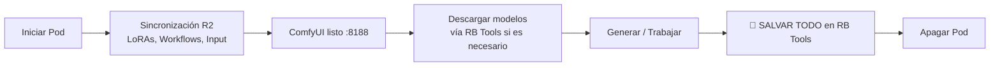

# ComfyUI Blackwell — RunPod Template

[](https://runpod.io)
[](https://github.com/comfyanonymous/ComfyUI)
[](https://www.nvidia.com)

Imagen Docker optimizada para **RTX 5090 (Blackwell sm_120)** con ComfyUI, gestión de configuración vía Cloudflare R2 y herramientas de administración integradas.

---

## 🚀 Puertos

| Puerto | Servicio | Descripción |
|--------|----------|-------------|
| **8188** | ComfyUI | Interfaz principal de generación de imágenes y video |
| **8888** | Jupyter Lab | Terminal y explorador de archivos avanzado |
| **8080** | File Browser | Explorador de archivos visual para subir/bajar archivos |

---

## 🔐 Variables de entorno requeridas

Configurar como **RunPod Secrets** (no como variables normales):

| Variable | Descripción |
|----------|-------------|
| `R2_ACCESS_KEY` | Clave de acceso de Cloudflare R2 |
| `R2_SECRET_KEY` | Clave secreta de Cloudflare R2 |
| `R2_ENDPOINT` | URL del bucket R2 (ej: `https://xxx.r2.cloudflarestorage.com`) |

---

## ⚡ Al arrancar el pod

El contenedor sincroniza automáticamente en background desde R2:

- ✅ Workflows guardados (`user/`)
- ✅ LoRAs (`models/loras/`)
- ✅ Imágenes de input (`input/`)

ComfyUI está disponible en ~30 segundos.

> ⚠️ **Los modelos grandes NO se descargan automáticamente**. Se descargan bajo demanda desde el panel **RB Tools** usando URLs directas con streaming.

---

## 🧰 RB Tools (Panel de Administración)

Panel integrado en el sidebar de ComfyUI. Accede desde el ícono 🔧 en la barra lateral.

### 💾 SALVAR TODO
Sube a R2 todo lo nuevo de la sesión:
- Workflows modificados
- LoRAs nuevas  
- Imágenes de input

> **Usar siempre al terminar la sesión antes de apagar el pod.**

### 📥 Descargar Modelos (Streaming + Paralelo)
Descarga modelos grandes desde **URLs directas** configuradas en `models_to_download.txt`.

**Características:**
- ✅ Descargas paralelas con threading para mayor velocidad
- ✅ Barras de progreso en tiempo real (MB/s)
- ✅ Soporte automático para tokens de HuggingFace y Civitai
- ✅ Botón **❌ Cancelar** que limpia archivos parciales
- ✅ Reanuda descargas interrumpidas si el archivo está incompleto

**Packs disponibles:**
| Pack | Descripción |
|------|-------------|
| **Klein 9B** | FLUX.2 Klein para generación de imágenes de alta calidad |
| **Klein Base 9B fp8** | Versión base optimizada para entrenamiento de LoRAs |
| **WAN 2.2 Animate** | Animación de personajes y movimiento |
| **WAN 2.2 I2V** | Image-to-Video: convierte imágenes en videos cortos |
| **WAN 2.2 T2V** | Text-to-Video: genera videos desde prompts de texto |

### 🖼 Imágenes de Input ↔ R2
Sincroniza imágenes de referencia usadas en nodos `Load Image` con R2. Ideal para mantener tus assets disponibles entre sesiones.

### 🧩 Update Nodes → Dockerfile → GitHub
Actualiza el Dockerfile cuando instales nuevos custom nodes vía ComfyUI Manager. Dispara un nuevo build automáticamente en GitHub Actions.

> ⚠️ Solo usar cuando instales o desinstales un custom node.

### ✏️ Agregar Pack de Modelos
Formulario para agregar nuevos packs al archivo de configuración en R2. Requiere:
- URL directa del modelo principal (checkpoint)
- URL del text encoder (opcional)
- URL del VAE (opcional)

---

## 🔑 Configuración de tokens

Subir el archivo `tokens.txt` a `R2/config/tokens.txt`:

```txt
HF_TOKEN=hf_xxxxxxxxxxxx
CIVITAI_TOKEN=xxxxxxxxxxxx
GITHUB_TOKEN=ghp_xxxxxxxxxxxx
```

RB Tools lee este archivo automáticamente para:
- Descargas autenticadas de HuggingFace (`Authorization: Bearer`)
- Descargas de Civitai (`?token=` en la URL)
- Updates del Dockerfile en GitHub vía API

---

## ⚙️ Configuración de modelos descargables

El archivo `R2/config/models_to_download.txt` define los packs disponibles. Formato:

```txt
PACK: Klein 9B
https://huggingface.co/rafaboni/flux2-klein/resolve/main/klein_9b.safetensors models/checkpoints/klein_9b.safetensors
https://huggingface.co/rafaboni/flux2-klein/resolve/main/encoder.safetensors models/text_encoders/encoder.safetensors
https://huggingface.co/rafaboni/flux2-klein/resolve/main/vae.safetensors models/vae/vae.safetensors

PACK: WAN 2.2 Animate
https://huggingface.co/rafaboni/wan22/resolve/main/wan_animate.safetensors models/checkpoints/wan_animate.safetensors
```

> 📌 **Importante**: 
> - Las URLs deben ser **enlaces directos de descarga** (no páginas HTML)
> - Usa `/resolve/` en HuggingFace, no `/blob/`
> - RB Tools usa `requests.get(stream=True)` para descargar eficientemente

---

## 🏗️ Arquitectura

```
RunPod Pod (RTX 5090 Blackwell)
│
├── 🌐 Servicios
│   ├── ComfyUI :8188
│   ├── Jupyter Lab :8888  
│   └── File Browser :8080
│
├── 📁 /workspace/ComfyUI/
│   ├── models/
│   │   ├── checkpoints/     ← Modelos (descarga bajo demanda vía HTTP streaming)
│   │   ├── loras/           ← LoRAs (sync con R2 al arrancar)
│   │   ├── text_encoders/   ← Encoders (descarga bajo demanda)
│   │   └── vae/             ← VAEs (descarga bajo demanda)
│   ├── input/               ← Imágenes de input (sync con R2 al arrancar)
│   ├── output/              ← Imágenes y videos generados
│   └── user/                ← Workflows (sync con R2 al arrancar)
│
└── 🔧 custom_nodes/comfyui-kb-tools/
    └── Panel RB Tools integrado en ComfyUI

Cloudflare R2 (bucket: comfy-models/)
│
├── loras/                   ← LoRAs persistentes
├── input/                   ← Imágenes de input persistentes  
├── user/                    ← Workflows persistentes
└── config/
    ├── tokens.txt           ← Tokens para descargas autenticadas
    └── models_to_download.txt  ← URLs directas HTTP/HTTPS de modelos
```

---

## 🐳 Registry Auth (Recomendado)

Para evitar rate limiting de Docker Hub al iniciar el pod:

1. Genera un **Access Token** en [Docker Hub Settings](https://hub.docker.com/settings/security)
2. En RunPod → Pod Template → Advanced → Registry Auth:
   - **Registry**: `docker.io`
   - **Username**: `rafaboni`
   - **Password**: `<tu_access_token>`

---

## 🔄 Flujo de trabajo recomendado



---

## 🛠️ Troubleshooting

| Problema | Solución |
|----------|----------|
| Descarga de modelo falla | Verificar que la URL sea directa (usa `/resolve/` en HF) |
| Token no funciona | Revisar formato en `tokens.txt` y permisos del token |
| RB Tools no aparece | Reiniciar ComfyUI o verificar que `comfyui-kb-tools` está en `custom_nodes/` |
| Sync con R2 lento | Verificar conexión y credenciales R2 en RunPod Secrets |
| Modelo ya descargado pero no aparece | Verificar que la ruta de destino en `models_to_download.txt` es correcta |

---

## 📄 Licencia

MIT License. Ver archivo `LICENSE` para detalles.

---
